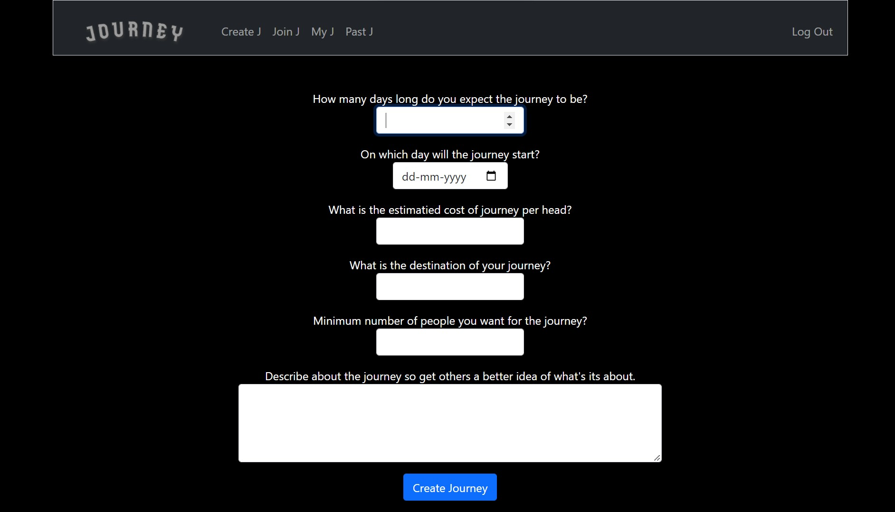

# JOURNEY
**Video Demo** :[Click here](https://www.youtube.com/watch?v=nRbLtyG1HXQ)
## **Overview:** 
The project allows users to make and post trips that others can join and they can join others
<br/>

## **Motivation** 
In my college, many of the residing students have a main friend circle that they spend most of their time with. As a result, whenever someone wants to go on a trip somewhere it only happens when all the students in their group agree to it so that no one is left behind. However this leads to two major issues: Firstly in many cases, it's unlikely that all the friends are available especially if it is a large group which results in that trip being postponed or canceled, secondly, this constricts people to a small group and they miss out on meeting many other incredible people. This project aims at tackling both these issues.

<br/>

## **How it works** 
The implementation overview is as follows: we have four functionalities that viewers can access after logging in, namely create, join, my, and past. We use to create to make a journey plan and use join to see and join the journey proposals made by others. Then in my, we can see all journeys we have registered for and the name and phone numbers of people who have registered for our journeys. Finally, we can contact each of them for further planning and at the end go on the trip. After the trips are done, all of them can be seen from the past tab.

<br/>

## **Registration and logging in**
The first thing we need to do is register ourselves. Registration has many fields namely username,roll_no,phone_no,email, password, and confirm password. Since the project is targeted towards college students, they need to fill their college roll_no. Additionally, if this was implemented as a college club project we can request a student's Intranet password as an authentication medium and access other needed information like roll_no and phone_no from the college database. If that approach is taken then registration will not be needed and we can guarantee no student is using someone else's roll_no. Unfortunately, that is not the case here so we work on the goodwill that students don't enter fake information. Also, many of the fields go through a simple test, and if some issue is found the user is told what he filled wrongly. If no issue is found the user is registered and his information is stored in a database called _users_. After being registered the user can log in and once logged in flask session feature is used so that the user doesn't need to log in, again and again, every time he revisits the site.

<br/>

## **Index** 
Once logged in the user is taken to index.html which is like our homepage. Here the user is welcomed and they can read about the vision of this project and get an understanding of how to use it. In the end, there is a hyperlink that users can use to send feedback to my email. Flask is used to get the username of the current session and jinja is used to display it on _index.html_. Also at the backend, this is where I checked it all three databases are exiting namely _users_, _trips_, and _entires_. If any one of them is not found then we create them. Note that only the first time we run the program with an empty database are they created. Once created they will always be there. Practically we could also have directly made those tables once in _records.db_ before running the program which will work the same. My approach is slightly more generic as even if the database is deleted or we are exporting the project we don't need to worry about any error due to the tables in the database not being found.

<br/>

## **Create** 
_create.html_ users an HTML form to take multiple information about a journey the user is planning. All information needed for a journey is as follows (days,start_date,est_cost, location,min_people,leader_roll_no, description) once the user enters all this a check is done to see if some bad input is not given, if not then in the _trips_ table a new row is created with all that information.

<br/>

## **Join** 
Here we can see all the journeys created by all other users whose end date is at least more than 5 days away from tomorrow. This is done using the datetime library. The 5 days are kept as a grace period so that the trip information can be planned and discussed by the creator and all users who joined. Each trip is shown on a card where all relevant information about the trip is shown and also how many people have already registered. For the front end aspect in _join.html_ all entities are called by name to_show, so first I checked if the length of to_show is even or odd. If it is odd then I initialized its last value in a variable called 'last' and then deleted that element changing the length to even. Then I pair two elements at a time and display them side by side as cards. Finally, if the last element was made we display that covering the full page. This could also have been done by some smart naming in CSS but using python is an easy-to-understand method albeit sightly long in terms of lines written in HTML mainly. As for the actual joining process I used the following lines in HTML
```
<form action="/join" method="post">
    <input type="hidden" name="trip_id" id="trip_id " value="{{i[0]['id']}}">
    <button class="btn btn-primary" type="submit">Join Journey</button>
</form>
```
then in the join function in app.py I used
```
request.form.get("trip_id")
```
to get the trip_id which i used to add the trip_id and member roll no in the _entries_ table.

<br/>

## **My** 
This is used to show all journeys the user is registered for and all journeys the user has created. The front to display each journey works on the same principle of join. In the journeys created section there are two new features - delete and a table. If for any reason we want to cancel a journey we just need to click delete in its card and using SQL it gets deleted. We can only delete the journeys that we have made. The table is used to show the name and phone numbers of users who have registered for that given journey. The creator can then create a WhatsApp group for further communications. There is also an improvement that can be added i.e to show a warning whenever the user clicks on delete to ask if he is sure which can be done using either creating a new HTML page or even better java-script.

<br/>

## **Past** 
Finally, this section shows all trips that have happened in the past as a way for users to see our track record leading to more transparency. Display of each journey uses the same technique as in join and my.

<br/>

## **Layout** 
Here a base HTML is created from which all other HTML extends using jinja. This allows for a more consistent look and less time if we want to change something that is to be seen on many HTML.

<br/>

### **Tech Stack used**

* [Python](https://www.python.org/)
* [Flask](https://flask.palletsprojects.com/en/2.2.x/)
* [HTML & CSS]()
* [SQL](https://www.w3schools.com/sql/)

<br/>

### **Installation**
Python must be installed on your system if running locally.

1. Clone the repo
   ```sh
   git clone https://github.com/Harsh-159/Journey.git
   ```

2. Install all dependencies
   ```sh
   pip install -r requirements.txt
   ```
3. Run flask 
   ```sh
   flask run
   ```
   
## **Screenshots**
<div align="center" ><br/>
Login<br/><hr width=600/>
  <br/><br/>
Homepage<br/><hr width=600/>
  <br/><br/>
Create a new journey<br/><hr width=600/>
  <br/>
Join a journey<br/><hr width=600/>
  <br/><br/>
Journeys joined and created<br/><hr width=600/>
  <br/><br/>
Past Jourenys<br/><hr width=600/>
  <br/>
</div>
<br/>

<!-- CONTACT -->
### **Contact**
Harsh Yadav - harshyadavhappy@gmail.com

<br/>

<br/>
